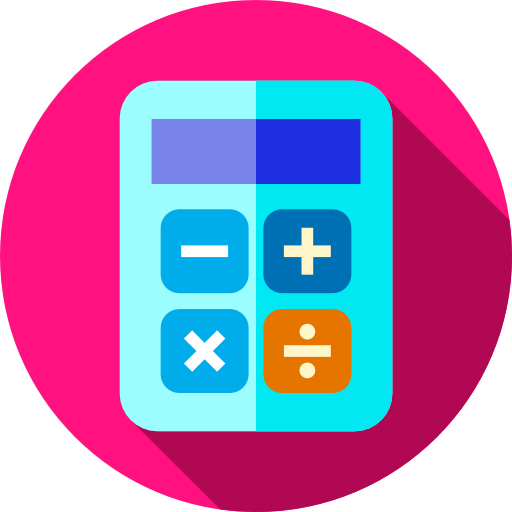

# Projeto Tabuada

Este projeto é uma aplicação web simples para gerar a tabuada de multiplicação de um número inserido pelo usuário. O usuário pode digitar um número e, ao clicar no botão, a aplicação exibirá a tabuada correspondente em uma lista.

## Tecnologias Utilizadas

- HTML
- CSS
- JavaScript

## Estrutura do Projeto

- `index.html`: O arquivo principal HTML que define a estrutura da página.
- `style.css`: O arquivo CSS responsável pela estilização da página.
- `script.js`: O arquivo JavaScript que contém a lógica para gerar a tabuada.

## Instruções de Uso

1. **Abrir a Página**: Abra o arquivo `index.html` em um navegador web.

2. **Inserir um Número**: No campo de entrada de número, digite o número desejado para gerar a tabuada.

3. **Gerar a Tabuada**: Clique no botão "Gerar Tabuada" para exibir a tabuada do número inserido.

4. **Visualizar a Tabuada**: A tabuada será exibida em uma lista de opções logo abaixo do botão.
